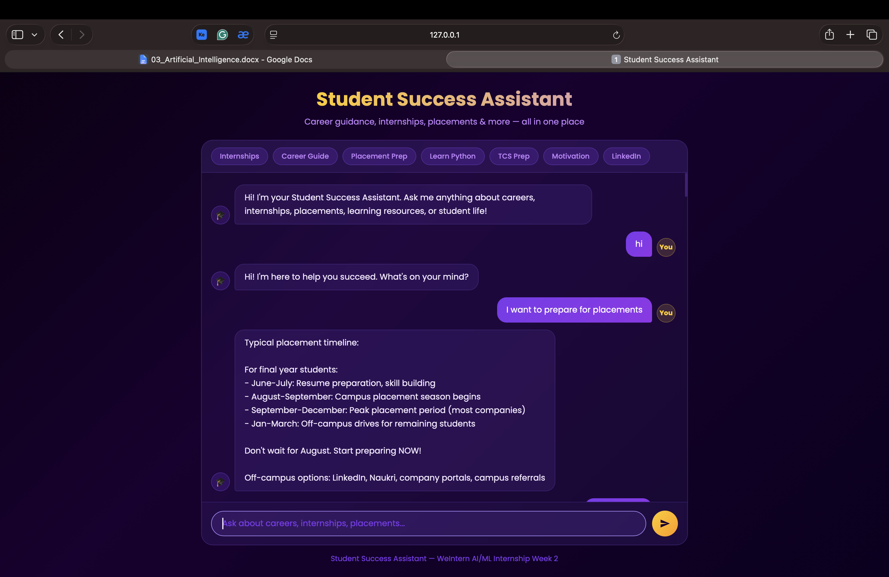
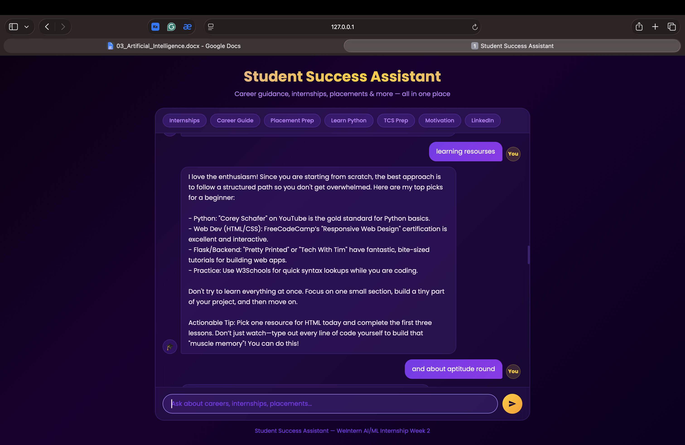

# Student Success Assistant

**A hybrid AI chatbot for Indian college students** — built with rule-based NLP and Google Gemini fallback, covering careers, internships, placements, learning, and student life.

> WeIntern Pvt Ltd · AI Internship · Week 2, Task 1

---

## Demo


*Quick-topic pills, multi-turn conversation, and Gemini-powered responses*


*Context-aware responses across multiple turns*

---

## How It Works

The chatbot uses a **two-layer response system**:

1. **Rule-based NLP** (NLTK + Jaccard similarity) — matches user input against 597 patterns across 61 intents. Fast, predictable, and always on-topic.
2. **Gemini AI fallback** — when no intent matches confidently, Google Gemini (`gemini-3.1-flash-lite`) steps in with a context-aware response using the last 4 turns of conversation history.

This means the bot handles both structured student queries and open-ended conversations gracefully.

---

## Features

- 61 intents · 597 patterns across 8 student-focused categories
- Hybrid NLP engine — Jaccard similarity + Gemini AI fallback
- Context-aware multi-turn conversation — remembers last topic in session
- Two interfaces — Flask web app + CLI terminal
- Quick-topic pills — one-click shortcuts in the web UI
- Auto session logging — every conversation saved to `responses/chat_log.txt`
- Deep purple and gold dark theme with Poppins font

---

## Project Structure

```
task1-student-chatbot/
│
├── app.py                     # Flask server + Gemini fallback logic
├── chatbot.py                 # NLP engine: preprocessing, matching, CLI loop
├── intents.json               # 61 intents with 597 training patterns
├── requirements.txt           # Python dependencies
│
├── templates/
│   └── index.html             # Chat UI with topic pills
│
├── static/
│   ├── style.css              # Dark purple/gold theme
│   └── script.js              # jQuery chat logic + typing indicator
│
├── responses/                 # All demo outputs
│   ├── chat_log.txt           # Auto-generated session logs
│   ├── screenshot1.png
│   ├── screenshot2.png
│   └── ...
│
├── INTENTS_DOCUMENTATION.md   # Full intent breakdown by category
└── README.md
```

---

## Tech Stack

| Component | Technology |
|---|---|
| Language | Python 3.x |
| NLP | NLTK — tokenization, lemmatization, stopword removal |
| Intent Matching | Custom Jaccard Similarity engine |
| AI Fallback | Google Gemini `gemini-3.1-flash-lite` via `google-genai` |
| Web Framework | Flask |
| Frontend | HTML · CSS · JavaScript (jQuery) |
| Session State | Flask `session` |
| Logging | Python `datetime` → `chat_log.txt` |

---

## Setup & Installation

### 1. Clone the repo

```bash
git clone https://github.com/euphoricv7/AI-Internship.git
cd AI-Internship/Week2/task1-student-chatbot
```

### 2. Install dependencies

```bash
pip install -r requirements.txt
```

### 3. Add your Gemini API key

In `app.py`, replace the placeholder:

```python
GEMINI_API_KEY = "your_api_key_here"
```

Get a free key at [Google AI Studio](https://aistudio.google.com/)

> NLTK packages (`punkt`, `stopwords`, `wordnet`) download automatically on first run.

---

## Running the App

### Web App (Flask)

```bash
python app.py
```

Open → `http://127.0.0.1:5001`

### CLI Interface

```bash
python chatbot.py
```

| Command | What it does |
|---|---|
| `help` | Lists all topics the bot covers |
| `history` | Shows last 5 conversation turns |
| `quit` / `exit` / `bye` | Ends the session |

---

## NLP Pipeline

```
User Input
    |
Preprocessing (NLTK)
Lowercase → Strip punctuation → Tokenize → Remove stopwords → Lemmatize
    |
Jaccard Similarity Matching
Score = |user tokens ∩ pattern tokens| / max(|user tokens|, |pattern tokens|)

Boosters:
  + 0.30  → if all pattern tokens found in user input
  + 0.01  → per overlapping token

    |
Score >= 0.5 → Return intent response
Score <  0.5 → Gemini AI fallback (with last 4 turns as context)
    |
Response shown in UI + appended to chat_log.txt
```

---

## Intent Coverage

61 intents across 8 categories — see [`INTENTS_DOCUMENTATION.md`](INTENTS_DOCUMENTATION.md) for the full table.

| Category | Intents |
|---|---|
| General Conversation | 7 |
| Career Guidance | 12 |
| Internships | 5 |
| Placement Preparation | 9 |
| Learning Resources | 7 |
| Soft Skills | 6 |
| Student Life & Motivation | 10 |
| Specialized Career Tracks | 5 |
| **Total** | **61 + 1 fallback** |

---

## Author

**Vratika Kumawat** · AI Intern, WeIntern Pvt Ltd
GitHub: [@euphoricv7](https://github.com/euphoricv7)

---

*Week 2 · Task 1 · Student Success Chatbot · WeIntern AI Internship*
