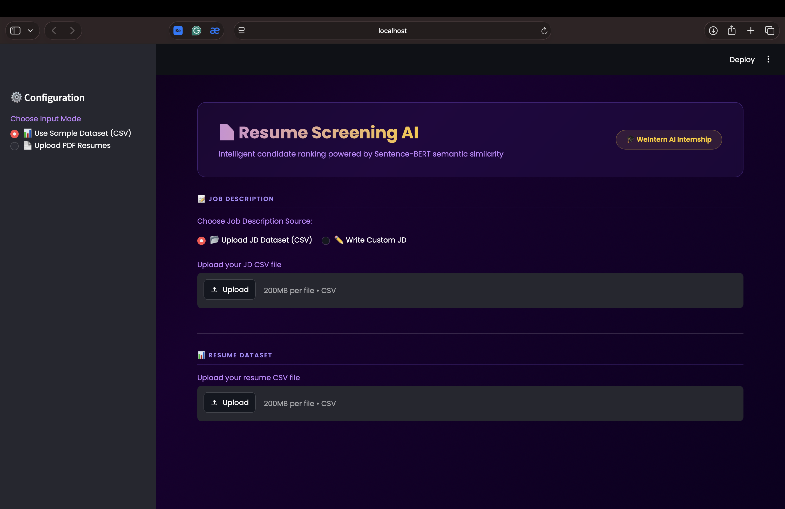

# Resume Screening AI

**An intelligent candidate ranking system** — powered by Sentence-BERT semantic similarity, ranking resumes against a job description with match scores, skill extraction, and verdicts.

> WeIntern Pvt Ltd · AI Internship · Week 2, Task 2

---

## Demo


*Upload JD and resume dataset, select a job role, and screen candidates*


*Ranked candidates with match scores, skill tags, progress bars, and verdicts*

---

## How It Works

1. User uploads a **Job Description** (CSV dataset or custom text) and a **Resume dataset** (CSV or PDF files)
2. Both JD and resumes are encoded into semantic embeddings using **Sentence-BERT** (`all-MiniLM-L6-v2`)
3. **Cosine similarity** is computed between the JD embedding and each resume embedding
4. Candidates are ranked by match score and assigned a verdict:
   - Score >= 50% → Strong
   - Score 35–49% → Maybe
   - Score < 35% → Not Recommended
5. Results are displayed as a leaderboard with stat cards, a top candidate highlight, and a downloadable CSV report

---

## Features

- Two input modes — CSV dataset or PDF resume upload
- JD input via CSV dataset (with job role selector) or custom text entry
- Sentence-BERT semantic similarity scoring — goes beyond keyword matching
- Skill extraction from 60+ predefined technical and soft skills
- Leaderboard-style results with gold/silver/bronze ranking
- Stat cards — Total Screened, Recommended, Maybe, Not Recommended
- Top candidate highlight card
- Download ranking report as CSV
- Deep purple and gold dark theme with Poppins font

---

## Project Structure

```
Task-2-Resume-Screening/
│
├── app.py                          # Main Streamlit application
├── dataset/
│   ├── job_descriptions_complete.csv    # Sample JD dataset (25 job roles)
│   ├── realistic_resume_dataset_100.csv # Sample resume dataset(csv) (100 candidates)
│   └── resume dataset pdf/              # Sample resume dataset(pdf)
├── requirements.txt              
├── responses/                      # Demo outputs
│   ├── screenshot1.png             # Main UI
│   ├── screenshot2.png             # Resultant leaderboard
│   └── screenshot3.png 
│
│
└── README.md
```

---

## Tech Stack

| Component | Technology |
|---|---|
| Language | Python 3.x |
| UI Framework | Streamlit |
| Semantic Similarity | Sentence-BERT (`all-MiniLM-L6-v2`) via `sentence-transformers` |
| Similarity Metric | Cosine Similarity (`sklearn.metrics.pairwise`) |
| PDF Parsing | pdfplumber |
| NLP | NLTK — tokenization, lemmatization, stopword removal |
| Data Handling | Pandas |

---

## Setup & Installation

### 1. Clone the repo

```bash
git clone https://github.com/euphoricv7/weintern-ai-internship.git
cd weintern-ai-internship/Week-2/Task-2-Resume-Screening
```

### 2. Install dependencies

```bash
pip install -r requirements.txt
```

> NLTK packages (`punkt`, `stopwords`, `wordnet`) download automatically on first run.
> Sentence-BERT model (`all-MiniLM-L6-v2`) downloads automatically on first run (~80MB).

---

## Running the App

```bash
streamlit run app.py
```

Open → `http://localhost:8501`

---

## How to Use

**Step 1 — Choose input mode** from the sidebar:
- Use Sample Dataset (CSV) — upload a resume CSV file
- Upload PDF Resumes — upload individual PDF files

**Step 2 — Upload a Job Description:**
- Upload JD Dataset CSV and select a job role from the dropdown, or
- Write a custom JD in the text area

**Step 3 — Upload resumes** (CSV or PDF depending on mode)

**Step 4 — Click "Screen Resumes"** and view the ranked results

**Step 5 — Download** the ranking report as CSV

---

## Scoring Algorithm

```
1. Preprocess text (lowercase, tokenize, remove stopwords, lemmatize)
2. Encode JD and all resumes using Sentence-BERT (all-MiniLM-L6-v2)
3. Compute cosine similarity between JD embedding and each resume embedding
4. Score = cosine_similarity * 100 (rounded to 2 decimal places)
5. Assign verdict:
     >= 50%  → Strong (Recommended)
     35-49%  → Maybe
     < 35%   → Not Recommended
6. Sort candidates by score (descending)
```

---

## Sample Datasets

Two sample datasets are included:

| File | Description |
|---|---|
| `job_descriptions_complete.csv` | 25 job roles with required and preferred skills |
| `realistic_resume_dataset_100.csv` | 100 candidates with name, education, skills, projects, experience |

---

## Requirements

```
streamlit
sentence-transformers
scikit-learn
pdfplumber
nltk
pandas
```

---

## Author

**Vratika Kumawat** · AI Intern, WeIntern Pvt Ltd
GitHub: [@euphoricv7](https://github.com/euphoricv7)

---

*Week 2 · Task 2 · Resume Screening AI · WeIntern AI Internship*
